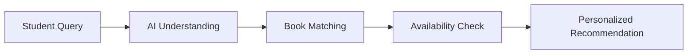

# LibraAI - AI-Powered Library Management Assistant

## 1. Overview
**LibraAI** is an intelligent, AI-powered campus library assistant designed to transform the traditional university library experience. It helps students intuitively search for books, understand their specific academic and learning requirements, verify physical shelf availability in real time, and receive tailored, pedagogical reading recommendations through a conversational interface.

---

## 2. Problem Statement
Traditional university library systems and OPAC (Online Public Access Catalog) portals rely heavily on exact keyword searches (such as exact title, author name, or ISBN). This creates significant limitations:
- **Search Friction:** Students often know what concept or skill they want to learn (e.g., "microcontroller registers for ECE") but do not know the exact textbook titles or authors.
- **Context Gap:** Standard searches cannot evaluate a student's background, branch of study, or target difficulty level (beginner vs. advanced research).
- **Availability Disconnect:** Finding a relevant book only to discover it is out of stock leads to wasted time and study delays.

---

## 3. Solution
LibraAI bridges the gap between natural human intent and library catalogs. By combining natural-language understanding, catalog metadata, real-time availability tracking, and automated pedagogical reasoning, LibraAI acts as a 24/7 intelligent research librarian. Students can describe their learning goals in plain English, and LibraAI instantly identifies the most suitable books, provides reasoning for each recommendation, and reports immediate physical stock status.

---

## 4. Key Features
- **AI-Powered Natural Language Book Recommendations:** Understands conversational prompts and user learning intents.
- **Smart Book Search:** Fast multi-field filtering across titles, authors, categories, descriptions, and keywords.
- **Library Availability Status:** Real-time stock counters labeled as `AVAILABLE`, `LIMITED`, or `BORROWED`.
- **Personalized Recommendations:** Delivers curated reading suggestions tailored to academic disciplines (ECE, CS, AI/DS, Mathematics, etc.).
- **Smart Alternatives for Unavailable Books:** Proactively suggests related in-stock titles when a preferred book is fully checked out.
- **Comprehensive Book Details:** Instant access to book overviews, syllabus topics, difficulty levels, and shelf placement.
- **Dual-Mode AI Engine:** Integrates Google Gemini with a robust local intelligent recommendation fallback engine.

---

## 5. How It Works



1. **Student Query:** The student submits a natural-language inquiry (e.g., *"I want to learn Python for complete beginners with projects"*).
2. **AI Understanding:** The system extracts key concepts, student branch context, and target difficulty level.
3. **Book Matching:** The recommendation engine scores catalog items against extracted semantic tokens.
4. **Availability Check:** Physical library inventory counts and shelf locations are verified.
5. **Personalized Recommendation:** The assistant presents ranked book cards with concise explanations of why each title matches the student's goals.

---

## 6. AI Technology
- **Google Gemini 1.5 Flash:** Used for cloud-based natural-language processing, contextual reasoning, and dynamic synthesis of recommendation rationale.
- **Local Intelligent Recommendation Fallback:** A deterministic semantic matching and scoring engine built directly into the client. This ensures zero downtime, allowing core recommendations, keyword matching, and availability checks to function seamlessly even if external AI services or network connections are unavailable.

---

## 7. Technology Stack
- **Frontend Framework:** React (Single-Page Architecture)
- **Build Tool:** Vite
- **Styling:** Tailwind CSS
- **AI / LLM Service:** Google Gemini API (`@google/generative-ai`)
- **Language:** JavaScript (ES6+)
- **Data Layer:** Local campus library dataset
- **Version Control:** Git & GitHub

---

## 8. Project Structure

```
nodex-library/
├── index.html                # Application entry HTML with Google Fonts
├── package.json              # Project dependencies and npm scripts
├── postcss.config.js         # PostCSS configuration for Tailwind
├── tailwind.config.js        # Tailwind CSS theme and color tokens
├── vite.config.js            # Vite development & build configuration
├── .gitignore                # Git exclusion rules
├── src/
│   ├── main.jsx              # React application root mount point
│   ├── App.jsx               # Single-page UI orchestration and state
│   ├── index.css             # Tailwind base styles and custom glassmorphism
│   ├── data/
│   │   ├── booksData.js      # Hardcoded 10-book catalog & recommendation scoring
│   │   └── mockLibrary.js    # Comprehensive campus catalog data & categories
│   ├── services/
│   │   ├── aiService.js      # Gemini API integration & local fallback engine
│   │   └── openLibraryService.js # Open Library API search utilities
│   ├── context/
│   │   └── LibraryContext.jsx # Global inventory state & toast notifications
│   └── components/           # Modular UI components (modals, cards, badges, views)
```

---

## 9. Installation

To set up and run the project locally:

```bash
# 1. Clone the repository
git clone https://github.com/vishnua-dev06/libra-ai-library-assistant.git

# 2. Navigate to the project directory
cd libra-ai-library-assistant

# 3. Install dependencies
npm install

# 4. Start the local development server
npm run dev
```

The application will be accessible at `http://localhost:5173/`.

---

## 10. Environment Variables
To use the live Google Gemini API integration, you can optionally configure an API key in a `.env` or `.env.local` file in the project root:

```env
VITE_GEMINI_API_KEY=your_gemini_api_key_here
```

> **Important:** Never commit API keys or confidential credentials to public version control. Ensure `.env` and `.env.local` remain in `.gitignore`. If no API key is provided, LibraAI automatically runs on its built-in local intelligent fallback engine.

---

## 11. Demo Walkthrough

### Example Prompt:
> *"I am an ECE student and want to learn embedded systems from beginner level."*

### System Response:
1. **Analysis:** LibraAI detects the **ECE** domain, **Embedded Systems** focus, and **Beginner** difficulty level.
2. **Recommendation:** Recommends *Making Embedded Systems* by Elecia White and *The Art of Electronics* by Paul Horowitz.
3. **Reasoning:** Explains that the book covers microcontroller design patterns, hardware-software interfacing, memory constraints, and register-level programming.
4. **Availability:** Confirms real-time shelf status (`LIMITED (3/5)` or `AVAILABLE`).

---

## 12. Future Scope
- **Real Library Database Integration:** Live sync with university ILS/Koha SQL databases.
- **User Authentication:** Student SSO and ID-card login.
- **Automated Book Reservations:** One-click reservation queues and hold placement.
- **Borrowing History & Analytics:** Personalized reading stats and course-specific reading lists.
- **Due-Date & Return Notifications:** Email/SMS alerts for upcoming return dates.
- **Voice Assistant Interface:** Hands-free voice querying for library kiosks.
- **Multilingual Support:** Regional and international language capabilities for diverse student bodies.
- **Advanced Personalization:** Machine learning recommendations based on syllabus changes and past borrowing trends.

---

## 13. Hackathon
**Built for the TCS Hackathon 2026.**

---

## 14. Contributors
- **Vishnu A**
- **Pranav**
- **Sidharth**
- **SreeJitha S**
- **Shahna S**
- **Rinfa A**
- **Muhammed Rizil C**
- **Roshan**

---

## 15. License
This project was developed as a hackathon prototype.
